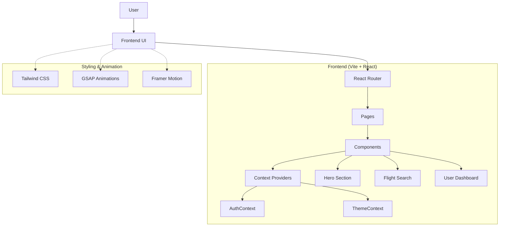

# ✈️ SkyWinks - Modern Airline Booking Platform

A premium, high-performance airline booking application built with modern web technologies. Designed for a seamless user experience with immersive animations, dark mode support, and a polished UI.

## ✨ Features

### 🎯 Core Capabilities
-   **Flight Search**: Intuitive interface to search for flights (One-way, Round-trip).
-   **User Authentication**: Secure login and registration system.
-   **My Bookings**: Manage and view upcoming and past trips.
-   **Responsive Design**: Fully optimized for desktop, tablet, and mobile devices.

### 🎨 UI/UX Excellence
-   **Immersive Hero Section**: 
    -   Scroll-triggered parallax takeoff animation.
    -   Dynamic airplane visuals that adapt to the theme.
-   **Dark Mode**: 
    -   Global smooth transition between light and dark themes.
    -   Custom "Cockpit Switch" toggle with realistic sound effects.
-   **Modern Aesthetics**: 
    -   Glassmorphism effects.
    -   Custom typography (Fluro, Neue Haas Grotesk).
    -   Interactive hover states and micro-animations.

## 🏗️ Architecture



## 📦 Tech Stack

-   **Framework**: [React](https://react.dev/) + [Vite](https://vitejs.dev/)
-   **Styling**: [Tailwind CSS](https://tailwindcss.com/)
-   **Animations**: 
    -   [GSAP](https://gsap.com/) (ScrollTrigger, Tweens)
    -   [Framer Motion](https://www.framer.com/motion/) (UI transitions)
-   **Routing**: [React Router](https://reactrouter.com/)
-   **Icons**: [Lucide React](https://lucide.dev/)

## 🚀 Quick Start

### Prerequisites
-   Node.js (v16 or higher)
-   npm or yarn

### Installation

1.  **Clone the Repository**
    ```bash
    git clone <repository-url>
    cd frontend-airline-app
    ```

2.  **Install Dependencies**
    ```bash
    npm install
    ```

3.  **Run Development Server**
    ```bash
    npm run dev
    ```
    Access the app at `http://localhost:5173`

## 📁 Project Structure

```
frontend-airline-app/
├── public/                 # Static assets (images, fonts, music)
├── src/
│   ├── components/         # Reusable UI components
│   │   ├── home/           # Home page specific components (Hero, Features, etc.)
│   │   ├── layout/         # Layout components (Header, Footer)
│   │   └── ui/             # Generic UI elements
│   ├── context/            # Global state (Auth, Theme)
│   ├── pages/              # Page views (Home, Login, Search)
│   ├── App.jsx             # Main application entry
│   └── index.css           # Global styles & Tailwind directives
├── .gitignore              # Git exclusion rules
├── package.json            # Project dependencies
├── tailwind.config.js      # Tailwind configuration
├── vercel.json             # Vercel deployment config
└── vite.config.js          # Vite configuration
```

## ⚙️ Configuration

### Environment Variables
Create a `.env` file in the root directory if you need to configure API endpoints:

```env
VITE_API_URL=http://your-backend-api.com
```

### Theme Customization
The theme is managed via `ThemeContext.jsx` and uses Tailwind's `dark` mode class.
-   **Colors**: Defined in `index.css` CSS variables (`--bg-primary`, `--text-primary`, etc.).
-   **Fonts**: Custom fonts are loaded in `index.css`.

## 🤝 Contributing

Contributions are welcome! Please:
1.  Fork the repository.
2.  Create a feature branch (`git checkout -b feature/AmazingFeature`).
3.  Commit your changes (`git commit -m 'Add some AmazingFeature'`).
4.  Push to the branch (`git push origin feature/AmazingFeature`).
5.  Open a Pull Request.

## 📄 License

This project is licensed under the MIT License.

---

**Happy Flying! ✈️**
