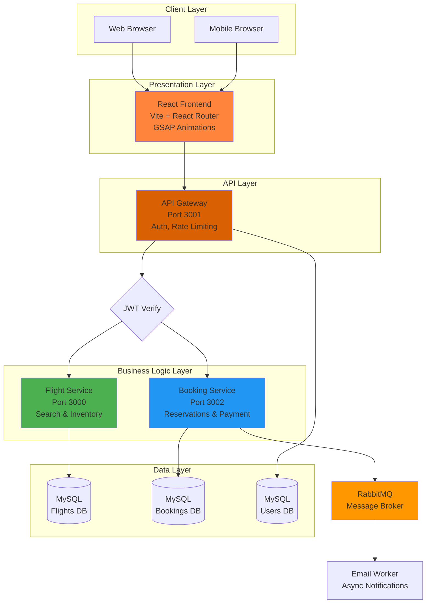
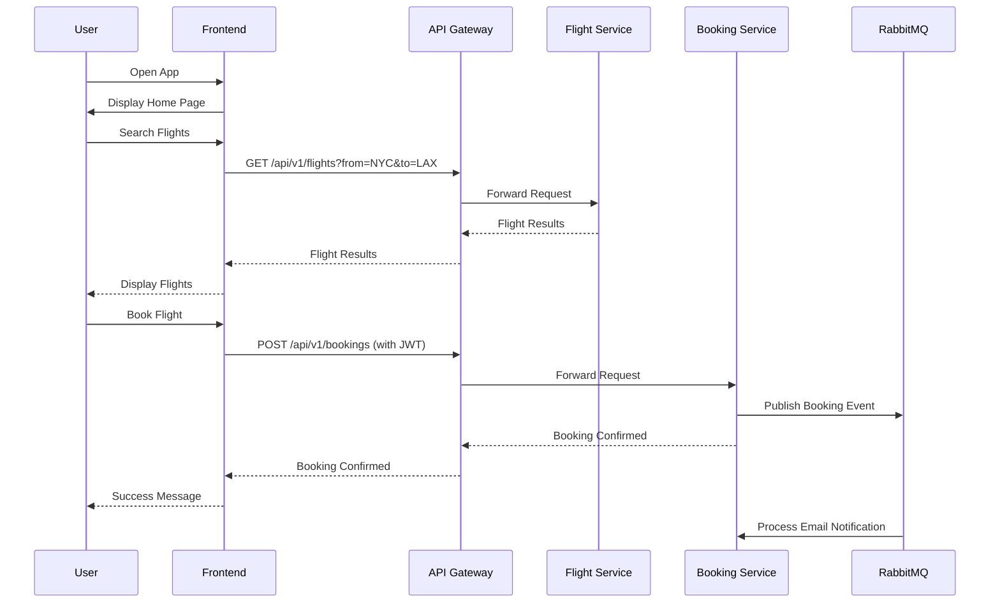

# ✈️ SkyWinks - Enterprise Airline Booking Microservices Platform

A production-ready, scalable airline booking system built on microservices architecture. Designed for high availability, fault tolerance, and seamless user experience with modern web technologies.

## ✨ Features

### 🎯 Core Capabilities
- **✈️ Flight Search & Discovery**: Real-time flight search with advanced filters (one-way, round-trip, multi-city)
- **🎫 Booking Management**: Secure ticket booking with payment integration
- **👤 User Authentication**: JWT-based secure authentication and authorization
- **📱 Responsive Design**: Mobile-first, fully responsive across all devices
- **🌍 Multi-City Support**: Comprehensive airport and city database

### 🛡️ Production Features
- ✅ **Microservices Architecture**: Independently scalable and deployable services
- ✅ **API Gateway**: Centralized routing, rate limiting, and security
- ✅ **Message Queue (RabbitMQ)**: Asynchronous booking processing and notifications
- ✅ **Database Isolation**: Separate MySQL databases per service for data integrity
- ✅ **GSAP Animations**: Premium scroll-triggered animations and transitions
- ✅ **Dark Mode**: Smooth theme switching with sound effects
- ✅ **Cron Jobs**: Automated booking expiration and cleanup tasks
- ✅ **Security**: Bcrypt password hashing, JWT verification, rate limiting

## 📋 Table of Contents
- [Architecture](#️-architecture)
- [Prerequisites](#-prerequisites)
- [Installation](#-installation)
- [Quick Start](#-quick-start)
- [Usage](#-usage)
- [Configuration](#️-configuration)
- [API Documentation](#-api-documentation)
- [Troubleshooting](#-troubleshooting)
- [Project Structure](#-project-structure)
- [Testing](#-testing)
- [Deployment](#-deployment)
- [Contributing](#-contributing)

## 🏗️ Architecture



### Component Overview

| Service | Port | Responsibility | Database | Key Dependencies |
|---------|------|----------------|----------|------------------|
| **Frontend** | 5173 | User interface, client-side routing | - | React, GSAP, Tailwind CSS |
| **API Gateway** | 3001 | Authentication, request routing, rate limiting | Users DB | Express, JWT, Sequelize |
| **Flight Service** | 3000 | Flight search, airport/city management | Flights DB | Express, Sequelize |
| **Booking Service** | 3002 | Ticket booking, payment processing | Bookings DB | Express, RabbitMQ, Node-Cron |

## 📦 Prerequisites

### Required Software

**Node.js 16+**
```bash
node --version  # Should be 16.x or higher
npm --version   # Should be 8.x or higher
```

**MySQL 5.7+ or 8.0+**
```bash
mysql --version
```
- Create databases: `flights_db`, `bookings_db`, `auth_db`

**RabbitMQ 3.8+** (For Booking Service)
```bash
# Windows: Download from https://www.rabbitmq.com/download.html
# Linux:
sudo apt-get install rabbitmq-server

# Mac:
brew install rabbitmq
```

Verify RabbitMQ is running:
```bash
# Access management UI at http://localhost:15672
# Default credentials: guest/guest
```

### Optional Software
- **Git**: For version control
- **Postman**: For API testing

## 🚀 Installation

### 1. Clone the Repository
```bash
git clone https://github.com/yourusername/skywinks-airline.git
cd Airline
```

### 2. Install Dependencies
Run the following commands to install dependencies for all services:

```bash
# Frontend
cd frontend-airline-app
npm install
cd ..

# API Gateway
cd API_Gateway
npm install
cd ..

# Flight Service
cd Flight_Service
npm install
cd ..

# Booking Service
cd Booking_Service
npm install
cd ..
```

### 3. Database Setup

**Create Databases:**
```sql
CREATE DATABASE flights_db;
CREATE DATABASE bookings_db;
CREATE DATABASE auth_db;
```

**Run Migrations:**
```bash
# In each service directory (API_Gateway, Flight_Service, Booking_Service)
cd API_Gateway
npx sequelize-cli db:migrate

cd ../Flight_Service
npx sequelize-cli db:migrate

cd ../Booking_Service
npx sequelize-cli db:migrate
```

### 4. Configure Environment

Create `.env` files in each service directory:

**API_Gateway/.env:**
```env
PORT=3001
DB_HOST=localhost
DB_USER=root
DB_PASS=yourpassword
DB_NAME=auth_db
JWT_KEY=your_jwt_secret_key_here
SALT=10
```

**Flight_Service/.env:**
```env
PORT=3000
DB_HOST=localhost
DB_USER=root
DB_PASS=yourpassword
DB_NAME=flights_db
```

**Booking_Service/.env:**
```env
PORT=3002
DB_HOST=localhost
DB_USER=root
DB_PASS=yourpassword
DB_NAME=bookings_db
RABBITMQ_URL=amqp://localhost
FLIGHT_SERVICE_URL=http://localhost:3000
```

**frontend-airline-app/.env:**
```env
VITE_API_URL=http://localhost:3001
```

## ⚡ Quick Start

### Step 1: Start Backend Services

Open **4 separate terminals** and run:

**Terminal 1 - API Gateway:**
```bash
cd API_Gateway
npm run dev
```
✅ Server running on `http://localhost:3001`

**Terminal 2 - Flight Service:**
```bash
cd Flight_Service
npm run dev
```
✅ Server running on `http://localhost:3000`

**Terminal 3 - Booking Service:**
```bash
cd Booking_Service
npm run dev
```
✅ Server running on `http://localhost:3002`

**Terminal 4 - Frontend:**
```bash
cd frontend-airline-app
npm run dev
```
✅ App running on `http://localhost:5173`

### Step 2: Access the Application

Open your browser and navigate to:
```
http://localhost:5173
```

### Step 3: Test the System

1. **Register a new account**: Click "Login" → "Sign Up"
2. **Search for flights**: Use the flight search interface
3. **Book a ticket**: Select a flight and complete booking
4. **View bookings**: Navigate to "My Bookings"

## 📖 Usage

### User Flow



### Key Features

**Flight Search:**
- Filter by origin, destination, date
- One-way, round-trip, multi-city options
- Real-time availability

**Booking Management:**
- Secure payment processing (integrated payment gateway stub)
- Email confirmations (via RabbitMQ worker)
- Booking history and status tracking

**User Dashboard:**
- View upcoming trips
- Access past bookings
- Manage profile

## ⚙️ Configuration

### Environment Variables Reference

| Variable | Description | Default | Required |
|----------|-------------|---------|----------|
| `PORT` | Service port | Varies | ✅ |
| `DB_HOST` | MySQL host | localhost | ✅ |
| `DB_USER` | MySQL username | root | ✅ |
| `DB_PASS` | MySQL password | - | ✅ |
| `DB_NAME` | Database name | - | ✅ |
| `JWT_KEY` | JWT secret key | - | ✅ (Gateway) |
| `RABBITMQ_URL` | RabbitMQ connection | amqp://localhost | ✅ (Booking) |
| `FLIGHT_SERVICE_URL` | Flight service endpoint | http://localhost:3000 | ✅ (Booking) |

### Service Ports

| Service | Port | Protocol |
|---------|------|----------|
| Frontend | 5173 | HTTP |
| API Gateway | 3001 | HTTP |
| Flight Service | 3000 | HTTP |
| Booking Service | 3002 | HTTP |
| MySQL | 3306 | TCP |
| RabbitMQ | 5672 | AMQP |
| RabbitMQ Management | 15672 | HTTP |

## 📡 API Documentation

### Authentication

**Register:**
```http
POST /api/v1/signup
Content-Type: application/json

{
  "email": "user@example.com",
  "password": "password123"
}
```

**Login:**
```http
POST /api/v1/signin
Content-Type: application/json

{
  "email": "user@example.com",
  "password": "password123"
}
```

**Response:**
```json
{
  "success": true,
  "data": "eyJhbGciOiJIUzI1NiIsInR5cCI6IkpXVCJ9...",
  "message": "Successfully signed in"
}
```

### Flights

**Search Flights:**
```http
GET /api/v1/flights?tripType=one-way&from=DEL&to=BOM&departureDate=2024-12-01
Authorization: Bearer {token}
```

### Bookings

**Create Booking:**
```http
POST /api/v1/bookings
Authorization: Bearer {token}
Content-Type: application/json

{
  "flightId": 1,
  "noOfSeats": 2,
  "totalCost": 5000
}
```

## 🔧 Troubleshooting

### Issue: "Connection Refused" for MySQL

**Solution:**
1. Ensure MySQL is running:
   ```bash
   # Windows
   net start MySQL80
   
   # Linux/Mac
   sudo service mysql start
   ```
2. Verify credentials in `.env` files
3. Check if databases exist:
   ```bash
   mysql -u root -p
   SHOW DATABASES;
   ```

### Issue: "RabbitMQ Connection Failed"

**Solution:**
1. Start RabbitMQ server:
   ```bash
   # Windows
   rabbitmq-server
   
   # Linux
   sudo service rabbitmq-server start
   ```
2. Check if port 5672 is available
3. Verify `RABBITMQ_URL` in `Booking_Service/.env`

### Issue: "CORS Error" in Frontend

**Solution:**
1. Ensure API Gateway has CORS enabled (check middleware)
2. Verify `VITE_API_URL` in `frontend-airline-app/.env`
3. Restart frontend dev server

### Issue: "JWT Token Invalid"

**Solution:**
1. Ensure `JWT_KEY` matches across services
2. Check token expiration (default: 1 day)
3. Clear browser cookies and login again

## 📁 Project Structure

```
Airline/
├── API_Gateway/                # Authentication & Routing Service
│   ├── src/
│   │   ├── config/            # Database config
│   │   ├── controllers/       # Request handlers
│   │   ├── middlewares/       # Auth, rate limiting
│   │   ├── models/            # User model
│   │   ├── routes/            # API routes
│   │   ├── utils/             # Helpers
│   │   └── index.js           # Entry point
│   ├── .env                   # Environment variables
│   └── package.json
│
├── Flight_Service/            # Flight Management Service
│   ├── src/
│   │   ├── config/
│   │   ├── controllers/       # Flight, city, airport logic
│   │   ├── models/            # Flight, City, Airport models
│   │   ├── repositories/      # Data access layer
│   │   ├── routes/
│   │   ├── services/          # Business logic
│   │   └── index.js
│   ├── .env
│   └── package.json
│
├── Booking_Service/           # Booking & Payment Service
│   ├── src/
│   │   ├── config/            # DB & RabbitMQ config
│   │   ├── controllers/       # Booking logic
│   │   ├── models/            # Booking model
│   │   ├── routes/
│   │   ├── services/          # Payment, messaging
│   │   └── index.js
│   ├── .env
│   └── package.json
│
├── frontend-airline-app/      # React Frontend
│   ├── public/                # Static assets (images, fonts, sounds)
│   ├── src/
│   │   ├── components/        # React components
│   │   │   ├── home/          # Homepage components
│   │   │   ├── layout/        # Header, Footer
│   │   │   └── ui/            # Reusable UI elements
│   │   ├── context/           # AuthContext, ThemeContext
│   │   ├── pages/             # Page views
│   │   ├── App.jsx            # Main app
│   │   ├── index.css          # Global styles
│   │   └── main.jsx           # Entry point
│   ├── .env
│   ├── package.json
│   ├── tailwind.config.js
│   ├── vite.config.js
│   └── vercel.json            # Deployment config
│
├── .gitignore                 # Git exclusions
├── package.json               # Root package
└── README.md                  # This file
```

## 🧪 Testing

### Manual Testing

**Test Authentication:**
```bash
# Register
curl -X POST http://localhost:3001/api/v1/signup \
  -H "Content-Type: application/json" \
  -d '{"email":"test@test.com","password":"test123"}'

# Login
curl -X POST http://localhost:3001/api/v1/signin \
  -H "Content-Type: application/json" \
  -d '{"email":"test@test.com","password":"test123"}'
```

**Test Flight Search:**
```bash
curl -X GET "http://localhost:3001/api/v1/flights?from=DEL&to=BOM" \
  -H "Authorization: Bearer YOUR_JWT_TOKEN"
```

**Test Booking Creation:**
```bash
curl -X POST http://localhost:3001/api/v1/bookings \
  -H "Authorization: Bearer YOUR_JWT_TOKEN" \
  -H "Content-Type: application/json" \
  -d '{"flightId":1,"noOfSeats":2,"totalCost":5000}'
```

## 🚀 Deployment

### Deploy Frontend to Vercel

```bash
cd frontend-airline-app
npm install -g vercel
vercel
```

Follow the prompts and your app will be live!

### Deploy Backend Services

**Option 1: Docker (Recommended)**
```bash
# Coming soon: Docker Compose configuration
```

**Option 2: Traditional Hosting**
- Deploy each service to separate instances (AWS EC2, DigitalOcean, etc.)
- Use PM2 for process management:
  ```bash
  npm install -g pm2
  pm2 start src/index.js --name api-gateway
  ```

## 🤝 Contributing

We welcome contributions! Please follow these steps:

1. **Fork** the repository
2. **Create** a feature branch:
   ```bash
   git checkout -b feature/AmazingFeature
   ```
3. **Commit** your changes:
   ```bash
   git commit -m 'Add some AmazingFeature'
   ```
4. **Push** to the branch:
   ```bash
   git push origin feature/AmazingFeature
   ```
5. **Open** a Pull Request

### Code Style
- Follow existing code patterns
- Use meaningful variable names
- Add comments for complex logic
- Test your changes before submitting

## 📄 License

This project is licensed under the ISC License.

## 🙏 Acknowledgments

- **Express.js**: Fast, unopinionated web framework
- **React**: UI library by Meta
- **Sequelize**: Promise-based ORM for Node.js
- **RabbitMQ**: Message broker for asynchronous processing
- **GSAP**: Professional-grade JavaScript animation
- **Tailwind CSS**: Utility-first CSS framework
- **JWT**: JSON Web Tokens for secure authentication

## 📞 Support

For issues and questions:

- 📧 **Email**: shreyasurade4940@gmail.com
- 🐛 **Issues**: [GitHub Issues](https://github.com/ShreyasUrade1123/SKYWINKS-Airline_Booking/issues)

## 🚦 Status

✅ User Authentication & Authorization  
✅ Flight Search & Filtering  
✅ Booking Management  
✅ Payment Processing (Stub)  
✅ RabbitMQ Integration  
✅ Frontend Dark Mode  
✅ GSAP Animations  
✅ Responsive Design  
🔄 Docker Containerization (In Progress)  
🔄 Full Payment Gateway Integration (Planned)  
🔄 Email Notifications (In Progress)  

---

**✈️ Happy Flying with SkyWinks! Built with ❤️ for seamless air travel experiences.**
